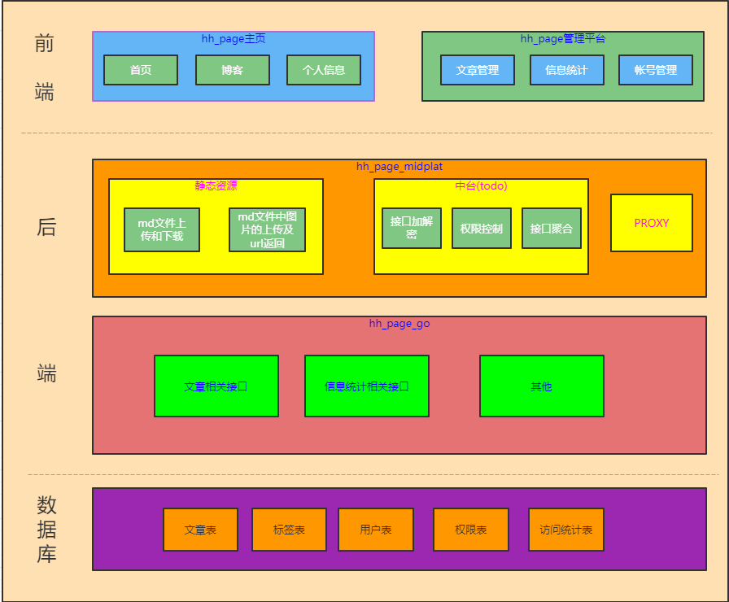

# hh_page_go

#### HH_PAGE
HH_PAGE是一个带有博客功能的[个人主页项目](http://blog.haoqian.icu/info)，本项目的最初目的是为了提高自己的前端技术水平，同时也验证一下自己再后端开发、项目部署等方面在近几年工作过程中的积累

#### 本仓库介绍
go后台服务：
    golang后台服务只对nodejs中台服务暴露，同时也只处理从中台服务发出的请求。本项目的中的数据库数据相关的curd都由golang后台服务实现。

#### 软件架构
HH_PAGE架构如图：

